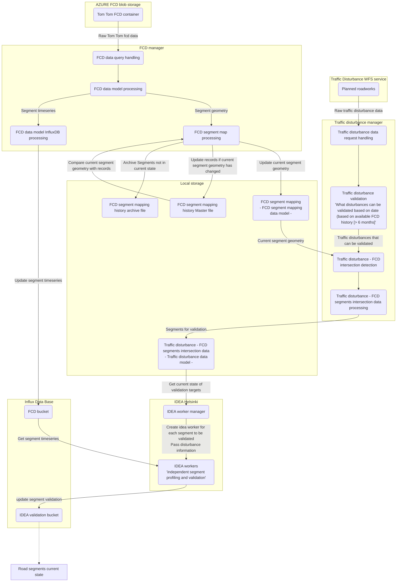

# IDEA-Helsinki
Repository for the IDEA Helsinki application developed for the TFDS-project. 

**ADD: Backsotry = "why-when-where", Project stakeholders, credits for the IDEA algorithm etc.**

## General configuration info

In it's current form, most of the configuration is done through the **constants** files:
- [Constants](/lib/Constants/Constants.py)
- [PrivateConstants](/lib/Constants/PrivateConstantExample.py)

## Program process schematic

*Copy pasted from [program_schematic](/docs/program_schematic.md)*

## Data models

Data models mentioned in the *Program process schematic*, are detailed in the [data models](/docs/data_models.md) documentation.

## Next steps in the development

1. Determine if data with geometry should be located in a database, instead of local storage.
   - Note that in Cloud deployment, *local storage* naturally is the default storage container provided.
2. 