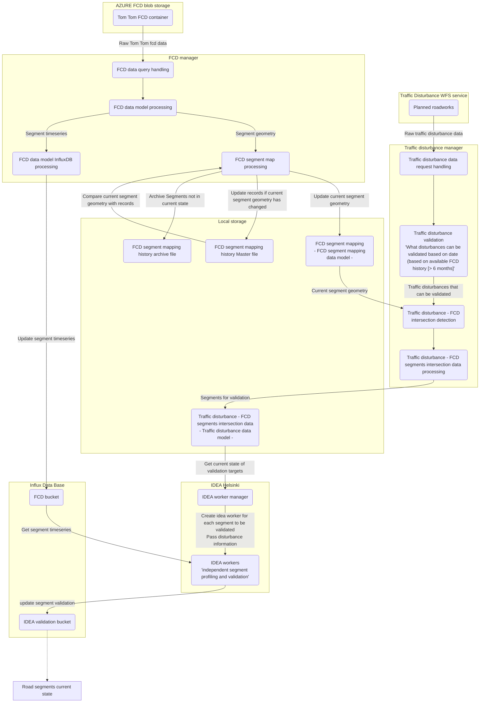

# IDEA-Helsinki
Repository for the IDEA Helsinki application developed for the TFDS-project.

**ADD: Backsotry = "why-when-where", Project stakeholders, credits for the IDEA algorithm etc.**

## Local Development Setup

### Prerequisites

Before setting up the local development environment, ensure you have the following tools installed:

- [gcloud CLI](https://cloud.google.com/sdk/docs/install) - Google Cloud command-line interface
- [Skaffold](https://skaffold.dev/docs/install/) - Kubernetes deployment automation
- [dotenvx](https://dotenvx.com/docs/install) (optional but recommended) - Environment variable management
- `envsubst` - Template substitution tool (usually pre-installed on macOS/Linux via gettext)

### Environment Configuration

The application uses environment variables for configuration. For local development, these are typically fetched from Google Secret Manager for consistency with production.

1. **Authenticate with Google Cloud:**
   ```bash
   gcloud auth application-default login
   gcloud config set project fvh-project-containers-etc
   ```

2. **Copy the environment template:**
   ```bash
   cp .env.example .env
   ```

   The `.env.example` file uses `gcloud` command substitution to fetch secrets:
   ```bash
   export AZURE_ACCOUNT_NAME="$(gcloud secrets versions access latest --project=fvh-project-containers-etc --secret=idea-helsinki-azure-account-name)"
   # ... etc
   ```

   **Alternative for local development**: You can also set values directly in `.env`:
   ```bash
   # Azure credentials
   export AZURE_ACCOUNT_NAME=your-account
   export AZURE_CONTAINER_NAME=your-container
   export AZURE_SAS_TOKEN=your-token

   # InfluxDB configuration (optional, uses defaults if not set)
   export INFLUX_DB_ORG=idea-helsinki
   export INFLUX_DB_URL=http://influxdb:8086
   export INFLUX_DB_FCD_BUCKET=fcd-data
   export INFLUX_DB_FCD_TOKEN=dev-token-changeme
   export INFLUX_DB_VALIDATION_BUCKET=validation
   export INFLUX_DB_VALIDATION_TOKEN=dev-token-changeme

   # Sentry (optional)
   export SENTRY_DSN=your-sentry-dsn
   ```

3. **Run with Skaffold:**
   ```bash
   dotenvx run -- skaffold dev
   ```

   The `skaffold dev` command will:
   - Load environment variables from `.env` (fetching from Google Secret Manager if using gcloud commands)
   - Generate `k8s/secrets.yaml` from `k8s/secrets.yaml.tmpl` using environment variables
   - Build all three service containers
   - Deploy to local Kubernetes (via OrbStack)
   - Enable hot-reload for code changes

### How Configuration Works

1. **Template file** (`k8s/secrets.yaml.tmpl`): Defines the structure of Kubernetes secrets with variable placeholders
2. **Skaffold hook**: Before deployment, runs `envsubst` to substitute environment variables into the template
3. **Generated file** (`k8s/secrets.yaml`): Created automatically, contains actual values (gitignored)
4. **Kubernetes**: Injects these secrets as environment variables into service containers

### Configuration Files

Configuration is split between:
- **Environment variables** (via `.env`) - Secrets and environment-specific settings
- **Kubernetes secrets** (`k8s/secrets.yaml.tmpl`) - Secret template for deployment
- **Constants files** - Application logic constants
  - [Constants](shared/src/idea_shared/lib/Constants/Constants.py)
  - [PrivateConstants](shared/src/idea_shared/lib/Constants/PrivateConstants.py)

## Program process schematic

*Copy pasted from [program_schematic](/docs/program_schematic.md)*



## Data models

Data models mentioned in the *Program process schematic*, are detailed in the [data models](/docs/data_models.md) documentation.

## HOT Fixes needed

- **Non critical fixes**
  - Update segment creation date to the master_segment_history.
    - This can always be checked from the InfluxDB, but it will be more convenient if found in the master_segment_history file.

## Next steps in the development

1. Evaluate the IDEA algorithm and enact modifications for segment validation precision
   - Constraints:
     - 6 moths of FCD segment history
     - 5 minute observation intervals
2. Determine if data with geometry should be located in a database, instead of local storage.
   - Note that in Cloud deployment, *local storage* naturally is the default storage container provided.
2. Methods of handling/managing segment geometry changes and their effect on timeseries history.
3. Implement IDEA 2.0 modifications, when they are outlined, detailed and algorithms are made available to the project.
