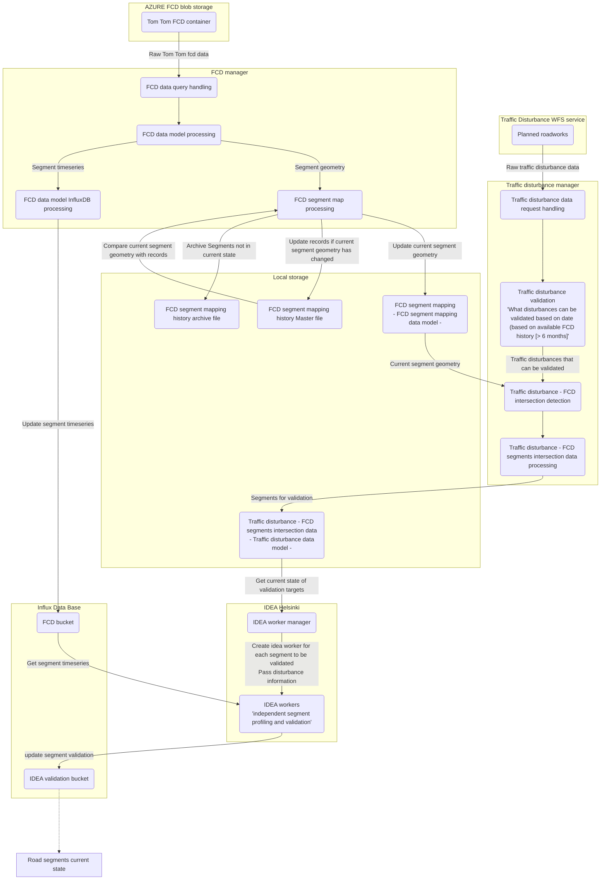

<div align="center">

# 🚗 IDEA-Helsinki

**Traffic validation system for analyzing the impact of traffic disturbances on road segments using real-time floating car data**

[](https://github.com/ForumViriumHelsinki/IDEA-Helsinki/actions/workflows/container-build.yml)
[]()
[]()
[]()

</div>

## Features

- **Real-time FCD Processing** - Ingests TomTom floating car data from Azure blob storage and maintains segment geometry mapping with SHA-256 change detection
- **Traffic Disturbance Integration** - Fetches planned roadworks from Helsinki WFS service and validates against 6-month FCD history requirement
- **Spatial Analysis** - Automatically detects which road segments are affected by traffic disturbances using geometric intersection detection
- **IDEA Validation Engine** - Runs independent async workers for segment profiling and compares actual vs. expected traffic patterns
- **Flexible Configuration** - Runtime feature flags and modular configuration for experimentation without redeployment
- **Microservices Architecture** - Three independent services (orchestrator, FCD manager, traffic monitor) for scalability and isolation

## Tech Stack

| Category | Technology |
|----------|------------|
| Runtime | Python 3.12 |
| Container Orchestration | Kubernetes (Skaffold) |
| Time-series Database | InfluxDB |
| Data Sources | Azure Blob Storage, Helsinki WFS API |
| Process Manager | asyncio |
| Package Manager | uv (workspace) |
| Testing | pytest |
| Cloud Platform | Google Cloud Platform (GKE) |

## Getting Started

### Prerequisites

Before setting up the local development environment, ensure you have the following tools installed:

- [Python 3.12+](https://www.python.org/downloads/)
- [uv](https://github.com/astral-sh/uv) - Fast Python package installer
- [gcloud CLI](https://cloud.google.com/sdk/docs/install) - Google Cloud command-line interface
- [Skaffold](https://skaffold.dev/docs/install/) - Kubernetes deployment automation
- [dotenvx](https://dotenvx.com/docs/install) - Environment variable management
- `envsubst` - Template substitution tool (pre-installed on macOS/Linux)
- [OrbStack](https://orbstack.dev/) or [Docker Desktop](https://www.docker.com/products/docker-desktop) - Local Kubernetes

### Installation

```bash
# Clone the repository
git clone https://github.com/ForumViriumHelsinki/IDEA-Helsinki.git
cd IDEA-Helsinki

# Install dependencies using uv
uv sync --all-packages --all-extras

# Set up environment
cp .env.example .env

# Start local Kubernetes with all services
dotenvx run -- skaffold dev
```

### Development Commands

```bash
# Run all tests (fast feedback during development)
just test-unit

# Pre-commit checks (format + lint + typecheck + unit tests)
just pre-commit

# Full test suite with coverage
just test-coverage

# Start local Kubernetes environment with hot-reload
skaffold dev

# Format code with ruff
just format

# Run linting checks
just lint

# Run type checks (matches CI's type-check job)
just typecheck
```

## Local Development Setup

### Prerequisites

Before setting up the local development environment, ensure you have the following tools installed:

- [gcloud CLI](https://cloud.google.com/sdk/docs/install) - Google Cloud command-line interface
- [Skaffold](https://skaffold.dev/docs/install/) - Kubernetes deployment automation
- [dotenvx](https://dotenvx.com/docs/install) - Environment variable management (required for pre-deploy hook)
- `envsubst` - Template substitution tool (usually pre-installed on macOS/Linux via gettext)

### Environment Configuration

The application uses environment variables for configuration. For local development, these are typically fetched from Google Secret Manager for consistency with production.

1. **Authenticate with Google Cloud:**
   ```bash
   gcloud auth application-default login
   gcloud config set project fvh-project-containers-etc
   ```

2. **Copy the environment template:**
   ```bash
   cp .env.example .env
   ```

   The `.env.example` file uses `gcloud` command substitution to fetch secrets:
   ```bash
   export AZURE_ACCOUNT_NAME="$(gcloud secrets versions access latest --project=fvh-project-containers-etc --secret=idea-helsinki-azure-account-name)"
   # ... etc
   ```

   **Alternative for local development**: You can also set values directly in `.env`:
   ```bash
   # Azure credentials
   export AZURE_ACCOUNT_NAME=your-account
   export AZURE_CONTAINER_NAME=your-container
   export AZURE_SAS_TOKEN=your-token

   # InfluxDB configuration (optional, uses defaults if not set)
   export INFLUX_DB_ORG=idea-helsinki
   export INFLUX_DB_URL=http://influxdb:8086
   export INFLUX_DB_FCD_BUCKET=fcd-data
   export INFLUX_DB_FCD_TOKEN=dev-token-changeme
   export INFLUX_DB_VALIDATION_BUCKET=validation
   export INFLUX_DB_VALIDATION_TOKEN=dev-token-changeme

   # Sentry (optional)
   export SENTRY_DSN=your-sentry-dsn
   ```

3. **Run with Skaffold:**
   ```bash
   skaffold dev
   ```

   The `skaffold dev` command will:
   - Execute the pre-deploy hook which:
     - Loads environment variables from `.env` via dotenvx (fetching from Google Secret Manager if using gcloud commands)
     - Runs `scripts/generate-secrets.sh` to generate `k8s/secrets.yaml` from the template
   - Build all three service containers
   - Deploy to local Kubernetes (via OrbStack)
   - Enable hot-reload for code changes

### How Configuration Works

1. **Template file** (`k8s/secrets.yaml.tmpl`): Defines the structure of Kubernetes secrets with variable placeholders
2. **Skaffold pre-deploy hook**: Before deployment, runs `dotenvx run -- sh scripts/generate-secrets.sh` which:
   - Loads environment variables from `.env` via dotenvx
   - Executes `generate-secrets.sh` which uses `envsubst` to substitute variables into the template
3. **Generated file** (`k8s/secrets.yaml`): Created automatically, contains actual values (gitignored)
4. **Kubernetes**: Injects these secrets as environment variables into service containers

### Configuration Files

Configuration is split between:
- **Environment variables** (via `.env`) - Secrets and environment-specific settings
- **Kubernetes secrets** (`k8s/secrets.yaml.tmpl`) - Secret template for deployment
- **Feature flags** (`data/feature_flags.json`) - Runtime feature toggles and configuration overrides
  - See [Feature Flags Documentation](shared/src/idea_shared/feature_flags/README.md)
- **Constants files** - Application logic constants
  - [Constants](shared/src/idea_shared/lib/Constants/Constants.py)
  - [PrivateConstants](shared/src/idea_shared/lib/Constants/PrivateConstants.py)

### Feature Flags

The application supports runtime feature toggles via feature flags. Create `data/feature_flags.json` from the example:

```bash
cp data/feature_flags.example.json data/feature_flags.json
```

Edit the file to enable/disable features like multithreading, caching, or experimental algorithms. Changes take effect after pod restart. See [Feature Flags Documentation](shared/src/idea_shared/feature_flags/README.md) for details.

### Volume Mounts

All three services mount the local `data/` directory into their containers at `/app/data`:
- `data/segments_mapping.json` - Current FCD segment geometries
- `data/master_segment_history.json` - Segment geometry change tracking
- `data/archived_segment_history.json` - Removed segments archive
- `data/traffic_disturbance_data.json` - Intersected segment-disturbance data
- `data/feature_flags.json` - Runtime feature flag configuration

This allows real-time updates to feature flags and shared data files without rebuilding containers.

## Project Structure

```
IDEA-Helsinki/
├── shared/                      # Shared library (idea-shared)
│   ├── src/idea_shared/
│   │   ├── managers/            # Core orchestration and data management
│   │   ├── models/              # Data models and structures
│   │   ├── providers/           # Azure, InfluxDB, WFS clients
│   │   └── feature_flags/       # Runtime feature toggles
│   └── tests/                   # Shared library tests
├── services/                    # Three independent microservices
│   ├── orchestrator/            # IDEA validation worker orchestration
│   ├── fcd-manager/             # FCD data synchronization and processing
│   └── traffic-monitor/         # Traffic disturbance detection
├── k8s/                         # Kubernetes manifests
│   ├── orchestrator-deployment.yaml
│   ├── fcd-manager-deployment.yaml
│   ├── traffic-monitor-deployment.yaml
│   ├── influxdb-statefulset.yaml
│   └── secrets.yaml.tmpl        # Secret template (generated into secrets.yaml)
├── data/                        # Persistent data files (mounted in K8s)
│   ├── segments_mapping.json
│   ├── master_segment_history.json
│   ├── traffic_disturbance_data.json
│   └── feature_flags.json
├── docs/                        # Documentation
│   ├── blueprint/               # Blueprint development configuration
│   ├── data_models.md
│   ├── VERSIONING.md
│   └── program_schematic.md
├── justfile                     # Task automation (just --list to see commands)
├── skaffold.yaml               # Local K8s development configuration
└── README.md                    # This file
```

## Testing

IDEA-Helsinki uses **pytest** with a uv workspace. Run tests using the Justfile:

```bash
# Fast unit tests (no external dependencies)
just test-unit

# All tests
just test

# Parallel testing (faster)
just test-parallel

# With coverage report
just test-coverage

# Full CI simulation
just ci
```

See [CLAUDE.md](CLAUDE.md#testing) for detailed testing documentation and manual test commands.

## Architecture

### System Overview

IDEA-Helsinki processes traffic data through a three-stage pipeline:

1. **FCD Manager** - Ingests TomTom floating car data from Azure, maintains segment geometry mapping
2. **Traffic Monitor** - Fetches traffic disturbances from Helsinki WFS, detects affected segments
3. **Orchestrator** - Runs IDEA validation workers for impact analysis

See [Program Process Schematic](/docs/program_schematic.md) for detailed data flow diagram.



## Data models

Data models mentioned in the *Program process schematic*, are detailed in the [data models](/docs/data_models.md) documentation.

## Documentation

- **[CLAUDE.md](CLAUDE.md)** - Comprehensive project instructions and development guidelines
- **[VERSIONING.md](docs/VERSIONING.md)** - Unified versioning strategy for all components
- **[Data Models](docs/data_models.md)** - Detailed specification of FCD and disturbance data structures
- **[Program Schematic](docs/program_schematic.md)** - Visual data flow diagram
- **[Feature Flags](shared/src/idea_shared/feature_flags/README.md)** - Runtime configuration documentation

## Contributing

Contributions are welcome! Please:

1. Follow conventional commit messages (feat:, fix:, docs:, etc.)
2. Write tests for new functionality (TDD workflow: RED → GREEN → REFACTOR)
3. Run `just pre-commit` before pushing
4. Reference any related GitHub issues or tickets

See [.claude/rules/development.md](.claude/rules/development.md) for detailed contribution guidelines.

## License

This project is licensed under the MIT License. See [LICENSE](LICENSE) for details.

## Acknowledgments

- **IDEA Algorithm**: Traffic impact validation algorithm
- **TomTom** - Real-time floating car data provider
- **Helsinki City** - WFS service for traffic disturbances
- **Forum Virium Helsinki** - Project organization and infrastructure support
