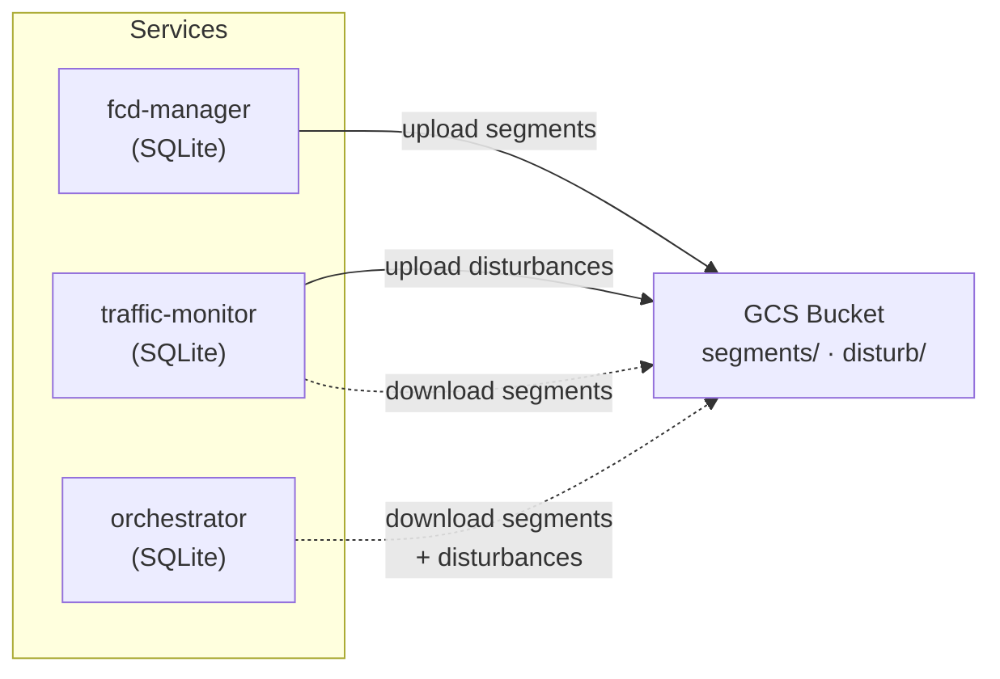

# Product Requirements Document: SQLite Migration

**Version:** 1.0
**Date:** 2026-03-19
**Status:** In Progress
**Related Issues:**
- [#147](https://github.com/ForumViriumHelsinki/IDEA-Helsinki/issues/147) — ESTALE errors on GCS FUSE
- [#168](https://github.com/ForumViriumHelsinki/IDEA-Helsinki/issues/168) — Data corruption from concurrent JSON writes
- [#240](https://github.com/ForumViriumHelsinki/IDEA-Helsinki/issues/240) — Unbounded segment history growth
- [#242](https://github.com/ForumViriumHelsinki/IDEA-Helsinki/issues/242) — 4 GB orchestrator memory from in-memory profiles
- [#248](https://github.com/ForumViriumHelsinki/IDEA-Helsinki/issues/248) — No spatial query support

## Executive Summary

Migrate IDEA Helsinki's persistent state from GCS FUSE-mounted JSON files to SQLite databases per service with GCS Object API for cross-service data sharing. This eliminates the root cause of production reliability issues (ESTALE, corruption, unbounded growth) while adding ACID transactions, bounded history, disk-backed profiles, and spatial query readiness.

## Problem Statement

### Current State

Three microservices (fcd-manager, traffic-monitor, orchestrator) share state through JSON files on a GCS FUSE-mounted volume:

| File | Writer | Readers | Size |
|------|--------|---------|------|
| `segments_mapping.json` | fcd-manager | traffic-monitor, orchestrator | ~50 MB |
| `master_segment_history.json` | fcd-manager | — | ~30 MB |
| `archived_segment_history.json` | fcd-manager | — | ~5 MB |
| `traffic_disturbance_data.json` | traffic-monitor | orchestrator | ~60 MB |

### Impact

1. **ESTALE errors (#147):** GCS FUSE metadata cache causes stale file handle errors when one pod writes and another reads. Current mitigation (retry with backoff) adds latency and complexity.
2. **Data corruption (#168):** GCS FUSE does not support file locking. Pod termination during writes produces truncated JSON. Current mitigation (corruption recovery in `JsonSegmentRepository.get_changelog`) loses historical data.
3. **Unbounded history growth (#240):** `master_segment_history.json` accumulates every geometry change forever. No retention policy exists; the file grows monotonically.
4. **Excessive memory (#242):** The orchestrator loads all segment profiles into memory (~4 GB). Profiles are Python dicts held for the lifetime of validation workers.
5. **No spatial queries (#248):** Intersection detection recomputes spatial joins on every cycle because JSON has no query capability. SpatiaLite would enable indexed spatial queries.

### Root Cause

GCS FUSE presents Cloud Storage objects as a POSIX filesystem, but it does not support:
- File locking (required for ACID transactions)
- Atomic rename across volumes (required for safe writes)
- Concurrent readers with a writer (metadata cache causes ESTALE)
- WAL mode or shared memory (required for SQLite on FUSE)

The single-writer discipline enforced at the application level partially mitigates corruption, but cross-service reads remain fundamentally unsafe on GCS FUSE.

## Goals

1. **Eliminate GCS FUSE** for all IDEA service pods (fcd-manager, traffic-monitor, orchestrator)
2. **ACID transactions** for all data mutations via SQLite
3. **Bounded history** with configurable retention (default: 50 entries per segment)
4. **Disk-backed profiles** so orchestrator memory stays under 1 GB
5. **Spatial query readiness** with schema that supports future SpatiaLite addition

## Non-Goals

1. PostgreSQL or PostGIS — overkill for single-writer workloads at this data volume
2. Rewriting TFDS_Dashboard — it will continue consuming JSON exports
3. SpatiaLite in initial scope — schema will support it, but spatial indexing is Phase 5+
4. Distributed database — each service owns its SQLite; cross-service sharing uses GCS Object API

## Proposed Solution

### Architecture



Each service:
1. Owns a local SQLite database for its primary data
2. Uploads changed data to GCS via Object API (not FUSE)
3. Downloads data from GCS that other services produce
4. Exports JSON for backwards compatibility with TFDS_Dashboard

### SQLite Schema (Phase 2)

**Segment tables** (fcd-manager):
```sql
CREATE TABLE segments (
    segment_id TEXT PRIMARY KEY,
    geometry TEXT NOT NULL,       -- GeoJSON
    geometry_hash TEXT NOT NULL,
    updated_at TEXT NOT NULL
);

CREATE TABLE segment_changelog (
    id INTEGER PRIMARY KEY AUTOINCREMENT,
    segment_id TEXT NOT NULL,
    geometry TEXT NOT NULL,
    geometry_hash TEXT NOT NULL,
    change_type TEXT NOT NULL,    -- 'added', 'modified', 'removed'
    recorded_at TEXT NOT NULL,
    FOREIGN KEY (segment_id) REFERENCES segments(segment_id)
);

CREATE TABLE segment_archive (
    segment_id TEXT PRIMARY KEY,
    last_geometry TEXT NOT NULL,
    last_hash TEXT NOT NULL,
    date_added TEXT,
    date_archived TEXT NOT NULL
);
```

**Disturbance tables** (traffic-monitor):
```sql
CREATE TABLE disturbances (
    segment_id TEXT PRIMARY KEY,
    geometry TEXT NOT NULL,         -- GeoJSON
    detailed_collisions TEXT,       -- JSON array
    updated_at TEXT NOT NULL
);
```

**Profile tables** (orchestrator):
```sql
CREATE TABLE profiles (
    segment_id TEXT PRIMARY KEY,
    profile_data BLOB NOT NULL,    -- Parquet-serialized DataFrame
    computed_at TEXT NOT NULL,
    expires_at TEXT
);
```

## Technical Implementation Plan

### Phase 1: Data Access Layer — COMPLETE

Abstract repository interfaces and JSON backend implementation. Decouples business logic from storage, enabling SQLite backend without changing service code.

**Files created:**
- `shared/src/idea_shared/data/__init__.py`
- `shared/src/idea_shared/data/repositories.py` — `SegmentRepository`, `DisturbanceRepository` ABCs
- `shared/src/idea_shared/data/json_backend.py` — `JsonSegmentRepository`, `JsonDisturbanceRepository`
- `shared/tests/unit/data/test_json_backend.py`
- `shared/tests/unit/data/test_changelog_processing.py`

**Files modified:**
- `shared/src/idea_shared/lib/FcdUtils.py` — Extracted `process_segment_changelog()` pure function, added `ChangelogResult` dataclass
- `shared/src/idea_shared/classes/IntersectionDetector.py` — Added `load_segments_from_repo()`, `save_disturbances_to_repo()`, extracted `_parse_segment_data()`
- `shared/src/idea_shared/classes/IdeaHelsinkiManager.py` — Added `disturbance_repository` parameter
- `services/fcd-manager/src/main.py` — Wired `JsonSegmentRepository`
- `services/traffic-monitor/src/main.py` — Wired `JsonSegmentRepository` + `JsonDisturbanceRepository`
- `services/orchestrator/src/main.py` — Wired `DisturbanceRepository`

### Phase 2: SQLite Implementations — NEXT

Implement SQLite backends for all three repository interfaces.

**Files to create:**
- `shared/src/idea_shared/data/migrations/001_initial.sql` — Schema DDL
- `shared/src/idea_shared/data/sqlite_backend.py` — `SqliteSegmentRepository`, `SqliteDisturbanceRepository`, `SqliteProfileRepository`

**Files to modify:**
- `shared/src/idea_shared/feature_flags/flags.py` — Add `USE_SQLITE_STORAGE` flag
- `shared/src/idea_shared/data/repositories.py` — Add `ProfileRepository` ABC
- `shared/src/idea_shared/classes/IdeaHelsinkiRoadSegment.py` — Lazy-load profiles from DB

### Phase 3: GCS Sync Layer

Replace GCS FUSE with Object API for cross-service data sharing.

**Files to create:**
- `shared/src/idea_shared/data/gcs_sync.py` — `GCSSync` with `upload()`, `download_if_changed()` (ETag caching)

**Dependencies to add:**
- `google-cloud-storage` Python library

### Phase 4: Service Wiring

Wire SQLite backends + GCS sync into all three services.

**Files to create:**
- `shared/src/idea_shared/data/json_export.py` — JSON export for TFDS_Dashboard backwards compatibility

**Files to modify:**
- All three service `main.py` files — Use `SqliteXxxRepository` + `GCSSync`
- Health checks — Query SQLite instead of JSON file existence
- Kubernetes manifests — Remove GCS FUSE mounts from IDEA service pods

### Phase 5: Cleanup

Remove JSON-only code paths and GCS FUSE infrastructure.

**Files to remove:**
- `shared/src/idea_shared/threading/file_locks.py` (GCS FUSE retry logic)
- `shared/src/idea_shared/data/json_backend.py`

**Files to modify:**
- `shared/src/idea_shared/feature_flags/flags.py` — Remove `USE_SQLITE_STORAGE` flag (SQLite is now the only backend)
- Kubernetes manifests — Remove GCS FUSE PVC from IDEA services
- `CLAUDE.md`, `docs/data_models.md` — Update documentation

## Success Metrics

| Metric | Target | Measurement |
|--------|--------|-------------|
| ESTALE errors | Zero | Sentry error count for `errno 116` |
| Data corruption events | Zero | Sentry alerts for `JSONDecodeError` on data files |
| Segment history entries per segment | ≤ 50 | SQLite query on `segment_changelog` |
| Orchestrator memory | < 1 GB | Kubernetes resource metrics |
| Test suite | All green at each phase | `just test` |

## Risks and Mitigation

| Risk | Impact | Mitigation |
|------|--------|------------|
| SQLite file growth on emptyDir | Medium | Retention policy (50 entries), `VACUUM` on startup |
| GCS Object API latency vs FUSE | Low | ETag-based caching; only download when changed |
| Migration data loss | High | Dual-write validation in Phase 4; JSON export preserved |
| SQLite file corruption on pod kill | Low | WAL mode + `PRAGMA synchronous=NORMAL`; SQLite handles this natively |
| TFDS_Dashboard breakage | Medium | JSON export layer maintains backwards compatibility |

## Dependencies

### Technical
- `sqlite3` — Python standard library
- `google-cloud-storage` — GCS Object API client (Phase 3)
- `pyarrow` — Parquet serialization for profiles (Phase 2, already in dependency tree)

### External
- GCS bucket with Object API access (existing infrastructure)
- Kubernetes emptyDir or hostPath for SQLite files (per-pod local storage)

## Testing Strategy

| Phase | Unit Tests | Integration Tests |
|-------|-----------|-------------------|
| 1 (DAL) | Repository contracts, changelog processing | — |
| 2 (SQLite) | `:memory:` SQLite, retention logic, schema migration | — |
| 3 (GCS Sync) | Mock GCS client | `fake-gcs-server` container |
| 4 (Wiring) | Feature flag toggling | Dual-write comparison |
| 5 (Cleanup) | Verify JSON backend removal | Full integration suite |

## Rollout Plan

1. **Feature flag**: `USE_SQLITE_STORAGE` defaults to `False`
2. **Dual-write period**: Both JSON and SQLite backends active; compare outputs
3. **Gradual cutover**: Enable `USE_SQLITE_STORAGE` in staging, then production
4. **Cleanup**: Remove JSON backend and feature flag after validation period

## Acceptance Criteria

### Phase 1 — COMPLETE
- [x] Abstract repository interfaces defined (`SegmentRepository`, `DisturbanceRepository`)
- [x] JSON backend implements all repository methods
- [x] All three services wired to use repository interfaces
- [x] Pure `process_segment_changelog()` function extracted from file I/O
- [x] Existing tests pass; new tests cover repository contracts

### Phase 2
- [ ] SQLite schema created via migration file
- [ ] `SqliteSegmentRepository` with retention logic
- [ ] `SqliteDisturbanceRepository` with full CRUD
- [ ] `SqliteProfileRepository` with Parquet serialization
- [ ] `USE_SQLITE_STORAGE` feature flag functional
- [ ] `just test` passes

### Phase 3
- [ ] GCS Object API upload/download with ETag caching
- [ ] Tests against `fake-gcs-server`
- [ ] `just test` passes

### Phase 4
- [ ] All three services use SQLite + GCS sync
- [ ] JSON export for TFDS_Dashboard backwards compatibility
- [ ] Health checks query SQLite
- [ ] GCS FUSE mounts removed from IDEA service pods
- [ ] Dual-write validation passes
- [ ] `just test` passes

### Phase 5
- [ ] `json_backend.py` and `file_locks.py` removed
- [ ] `USE_SQLITE_STORAGE` feature flag removed
- [ ] GCS FUSE PVC removed from k8s manifests
- [ ] Documentation updated
- [ ] `just test` passes

## Issue Resolution Map

| Issue | Problem | Resolution Phase |
|-------|---------|-----------------|
| [#147](https://github.com/ForumViriumHelsinki/IDEA-Helsinki/issues/147) | ESTALE errors | Phase 3 (GCS Object API replaces FUSE) |
| [#168](https://github.com/ForumViriumHelsinki/IDEA-Helsinki/issues/168) | Data corruption | Phase 2 (SQLite ACID transactions) |
| [#240](https://github.com/ForumViriumHelsinki/IDEA-Helsinki/issues/240) | Unbounded history | Phase 2 (retention policy on changelog) |
| [#242](https://github.com/ForumViriumHelsinki/IDEA-Helsinki/issues/242) | 4 GB memory | Phase 2 (disk-backed profiles via SQLite) |
| [#248](https://github.com/ForumViriumHelsinki/IDEA-Helsinki/issues/248) | No spatial queries | Phase 2 (schema supports SpatiaLite) |

## Revision History

| Version | Date | Author | Changes |
|---------|------|--------|---------|
| 1.0 | 2026-03-19 | Claude Code | Initial PRD creation |
